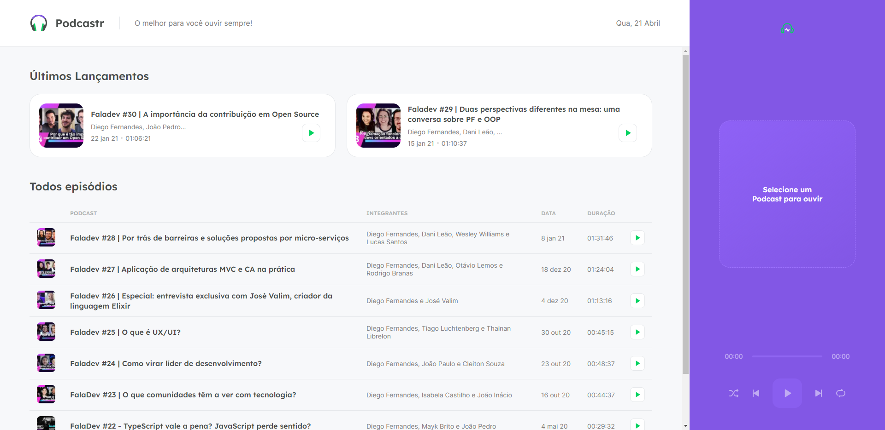

# Podcastr

Durante a quinta edição do Next Level Week, um evento criado pela Rocketseat, estamos desenvolvendo do zero uma aplicação utilizando o framework react js. A aplicação se trata de um site para ouvir podcasts. 

## Preview

## Tecnologias utilizadas

> - Typescript
> 
> - Javascript
> 
> - CSS/SCSS
>
> - Conceitos de HTML
> 

## Bibliotecas

> - sass
>
> - date-fns
>
> - axios